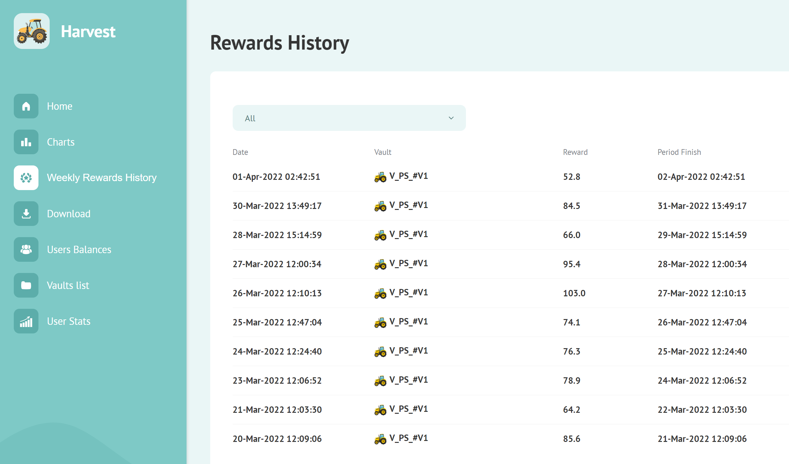

# Getting a User's Transactions on Ethereum

While UI/UX for Web3 dApps is constantly evolving, one piece of key functionality has persisted throughout the years: the concept of a user’s historical transactions.

Web3 netizens are accustomed to seeing a historical list of interactions with different DeFi staking protocols, deposits/withdrawals to centralized exchanges, or Uniswap transactions. While block explorers like Etherscan provide an unfiltered portal of a user’s account and all its on-chain interactions, many dApps also have a more condensed view of a user’s previous interactions on that specific application. Historical account activity is sometimes displayed as a simple list or can be processed and rolled up into simple dashboards for more intuitive viewing.



With historical transactions a de-facto part of any Web3 dApp, it’s important to understand how to integrate it into your application. In this tutorial, we’ll look at an example of how, with just a few lines of code, your dApp can integrate the Alchemy Transfers API to query and serve up historical address activity.

For more detailed information on the Alchemy Transfers API, please refer to its [docs page](./)!

## Getting Started&#x20;

When using the Transfers API for querying a user’s full on-chain history, its important to have a few key API parameters on hand.

1. `fromBlock`

The `fromBlock`API parameter determines the start of the block range that you seek to query address information for. In the Transfers API, it is passed in as a hex string. When querying the full history of an address’s on-chain interactions, we suggest looking back to the very beginnging or the 0th block (**0x0**). If you’re looking to offer a condensed view of an address’s interactions with a particular DeFi protocol, you can also start your search with the date of the protocol’s contract deployment.


NOTE: Intuitively, we more often think of blocks within the standard integer form so don’t forget to convert units!


2\. `category`

The category parameter helps you filter for specific transfers. You can pass in any of the following strings as a list: `external`, `internal`, `token`, `erc20`, `erc721`, `erc1155` If unprompted, the default will be \["`external`", "`internal`", "`token`"]).

When searching through a user’s entire transfer history, the default parameter will work!

_****_

_**OPTIONAL**_

If you’re looking to query historical transactions limited to a particular set of tokens, you can also use the `contractAddresses`parameter which accepts a list of contract addresses in a hex string format and can be used to filter the ERC20/721/1155 token addresses returned in the response. For addresses with a large number of transfers due to spam, passing in this parameter will help speed up your queries!


NOTE: The default use of this parameter, without specifying an address, returns any and all transfers by any token address.



## Code Examples

Awesome! Now that we know the key parameters we need to pass into the Transfers API, let’s try our hand at querying the historical transfers for the address _0x5c43B1eD97e52d009611D89b74fA829FE4ac56b1_

### Querying via Alchemy Web3.js (Recommended)

\
If you don't already have Alchemy Web3 installed, you can install the `alchemy-web3` module to easily interact with Alchemy APIs. We highly recommend using the `alchemy-web3` sdk because you also get websocket support, retries, and other benefits without the complexity!

For full documentation on `alchemy-web3`, check the [Github repo](https://github.com/alchemyplatform/alchemy-web3).

Here's a code snipper for `alchemy-web3` users!

```javascript
// alchemy-nft-api/alchemy-web3-script.js
import { createAlchemyWeb3 } from "@alch/alchemy-web3";

// Replace with your Alchemy api key:
const apiKey = "demo";

// Initialize an alchemy-web3 instance:
const web3 = createAlchemyWeb3(
  https://eth-mainnet.alchemyapi.io/v2/${apiKey},
);

const data = await web3.alchemy.getAssetTransfers({
  fromBlock: "0x0",
  fromAddress: "0x5c43B1eD97e52d009611D89b74fA829FE4ac56b1",
})

// Print response:
console.log(data);
```

### Querying via Node-Fetch

\
If you're using`node-fetch` a lightweight, common module that brings the Fetch API to Node.js and allows us to make our HTTP requests, here's a code snipper for the request you'd make!

```javascript
import fetch from 'node-fetch';

  let data = JSON.stringify({
  "jsonrpc": "2.0",
  "id": 0,
  "method": "alchemy_getAssetTransfers",
  "params": [
    {
      "fromBlock": "0x0",
      "fromAddress": "0x5c43B1eD97e52d009611D89b74fA829FE4ac56b1",
    }
  ]
});


  var requestOptions = {
    method: 'POST',
    headers: { 'Content-Type': 'application/json' },
    body: data,
    redirect: 'follow'
  };

  const apiKey = "demo"
  const baseURL = https://eth-mainnet.alchemyapi.io/v2/${apiKey};
  const fetchURL = ${baseURL};

  fetch(fetchURL, requestOptions)
    .then(response => response.json())
    .then(response => JSON.stringify(response, null, 2))
    .then(result => console.log(result))
    .catch(error => console.log('error', error));
```

### Querying via Axios

\
If you're using Javascript `axios`, a promise-based HTTP client for the browser and Node.js which allows us to make a raw request to the Alchemy API, here's a code snipper for the request you'd make!

```javascript
import axios from 'axios';

  let data = JSON.stringify({
  "jsonrpc": "2.0",
  "id": 0,
  "method": "alchemy_getAssetTransfers",
  "params": [
    {
      "fromBlock": "0x0",
      "fromAddress": "0x5c43B1eD97e52d009611D89b74fA829FE4ac56b1",
    }
  ]
});


  var requestOptions = {
    method: 'post',
    headers: { 'Content-Type': 'application/json' },
    data: data,
  };

  const apiKey = "demo"
  const baseURL = https://eth-mainnet.alchemyapi.io/v2/${apiKey};
  const axiosURL = ${baseURL};

  axios(axiosURL, requestOptions)
    .then(response => console.log(JSON.stringify(response.data, null, 2)))
    .catch(error => console.log(error));
```
