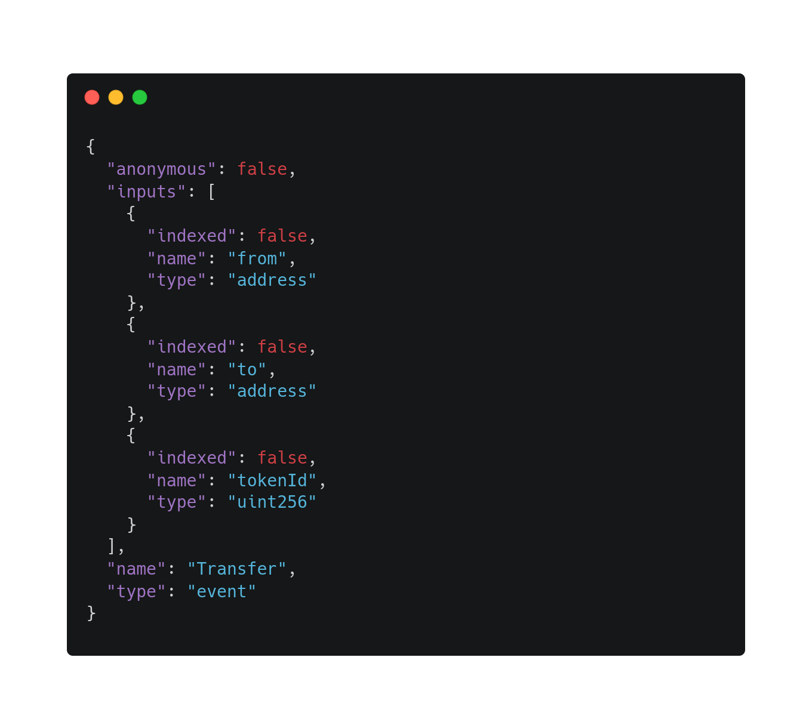

# Understanding Ethereum Logs

A core part of Web3 or decentralized applications (dApps) is the ability to understand when and what events happen on a blockchain. These events can trigger updates or notifications within the application that are then communicated to users. To allow users to easily access data about these events from outside of the blockchain, the [Ethereum Virtual Machine (EVM) ](https://www.alchemy.com/overviews/what-is-the-ethereum-virtual-machine-evm)keeps an event log on the transactions of every block. To be able to read and understand these logs, let's explore two main concepts: **events** and **logs**. This article will show how these two concepts connect to deliver important information about on-chain events.

## Events in Ethereum&#x20;

**Events are any action executed by a smart contract.**&#x20;

The most popular event type is a [Transfer event](../enhanced-apis/transfers-api/#what-are-transfers). Transfer events are whenever wallet addresses transfer tokens to one another. Transfers are common in ERC20, ERC721, and ERC1155 token contracts. In Solidity, events are defined in the smart contract itself like the below example. Events use the 'emit' keyword to add the event to the log records. We will explore later how this information is stored as an event signature in the topics section of the logs.

.png>)

### Why you should use events on Ethereum

An advantage of using events is that they are cheap on gas fees compared to other functions of the EVM. This information can be read outside applications, and that data can then be used to perform an action, like updating the front-end.&#x20;

Another benefit of events is that they allow us to search the blockchain. For example, an application can track a certain event type or an address and notify the user whenever that event happens or a wallet receives a transfer. Events can be marked as indexed, which allows for applications to pull historical data about an address easily. A use case for this would be to display the past transactions of a wallet to give the user's the ability to see all of their transactions over time.&#x20;

All of this information about events can be found in the EVM logs.

## Ethereum Virtual Machine Event Logs

**EVM logs create a record of all the events that happen on the Ethereum virtual machine.**

Logs are part of the transaction receipts. Every [completed block](https://docs.alchemy.com/alchemy/resources/web3-glossary#block) contains a log that is publicly accessible. These logs contain information like the block hash, block number, and the amount of gas used for the block in total and on a transaction level. The EVM gathers this information from smart contracts’ ABIs.

### Smart Contract ABI&#x20;

[**A smart contract's ABI**](https://www.alchemy.com/overviews/what-is-an-abi-of-a-smart-contract-examples-and-usage) **is a list of the events and information that is within the smart contract**. It is a function selector to allow the specific methods of a smart contract to be executed.    &#x20;


An ABI is a JSON **** file that most tools like Remix will automatically generate after compiling a smart contract's code. The ABI gets encoded into bytecode so that the EVM can read and execute the functions within the smart contract.



Starting from the bottom of the ABI example, you can see the event name and type are defined. Then moving up, you can see there is a list of 'inputs' which are parameters that include the to and from addresses as well the value type exchanged.&#x20;

Included in the inputs list is whether or not the parameter is indexed. Indexing allows for the event history to be easily searchable by another application. For any event, up to 3 parameters can be indexed. For example, the '`to`' and '`from`' addresses and the '`type`' can be indexed so that an application can easily watch for token transfers that are received by a user's wallet address and of a certain type

## Parameters of Ethereum event logs&#x20;

For this article, we will focus on three parameters of the logs: `address`, `data`, and `topics`. Somewhat confusingly, these objects appear in the block logs as objects in an array called 'logs'.

### Contract Address Field

**The address field is the address of the smart contract that is responsible for creating the event.** This is the first field under the logs array.

.png>)

### Data Field&#x20;

**The data field holds the information of the parameters in the contract's ABI that have not been set to be indexed.** While the topics field, which we will explore next, describes what types of events occurred, the data field contains the actual values of that transfer. This would include which address sent and received funds as well as the amount that has been transferred.


The example above is a data field where there is a transfer between two addresses. The 'from' address appears after the first series of zeros, then the 'to' after the next set of zeros, and then finally the amount written in hexadecimal at the end. The data field has no limit to what can be stored which makes it a cheap solution in regards to the gas cost for storing data like arrays and strings. This is unlike the topics field which does have a hard limit.

### Topics Field

**Topics are the field that stores all parameters in an event that have been set to index in the contract ABI.** Indexing these events gives them the ability to be easily searched by off-chain applications. Topics describe the type of events that are logged and are stored in a hash with a limit of 32 bytes. The code of the topics is created by taking event signatures like a transfer (address, address, uint256) and hashing it with the keccak256 hashing function in Solidity.&#x20;

These codes are then [stored as opcodes](https://www.alchemy.com/overviews/what-is-the-ethereum-virtual-machine-evm#evm-4) on the EVM. There is currently a limit of 5 opcodes (LOG0 - LOG4) that can be used for logging event information.


The different log opcodes can be used for different amounts of topics. For example, LOG2 can be used for 2 topics while LOG4 can be used for 4 topics. Typically the first topic contains the name of the event and the next topics contain the types such as string or uint256.

## Accessing the Ethereum Event Logs using Alchemy &#x20;

**To access Ethereum event logs, you can use** [**eth\_getLogs method**](https://docs.alchemy.com/alchemy/apis/ethereum/eth-getlogs) **using the Alchemy API to retrieve the log information you are interested in:**

```
URL: https://eth-mainnet.alchemyapi.io/v2/your-api-key
RequestType: POST
Body: 
{ 
  "jsonrpc":"2.0",
  "method":"eth_getLogs",
"params": [
  {
    "address": "0xb59f67a8bff5d8cd03f6ac17265c550ed8f33907",
    "topics": [
      "0xddf252ad1be2c89b69c2b068fc378daa952ba7f163c4a11628f55a4df523b3ef"
    ],
    "blockHash": "0x8243343df08b9751f5ca0c5f8c9c0460d8a9b6351066fae0acbd4d3e776de8bb"
  
  }],
  "id":0
}
```

**Note: It is not required to use all filters, just the ones that will return the logs that are needed for the use case.**

The core reason for logging events is so that outside applications can understand what events have taken place on-chain. It is therefore important that applications can easily access this information to then display it to users on the front-end.

## Conclusion

Communication between the EVM and application is an important part of delivering value to users. Logging events of a smart contract allows for connections between the on-chain events within a smart contract and the off-chain services offered by an outside application. Using tools like the [Alchemy Ethereum API ](https://docs.alchemy.com/alchemy/apis/ethereum) allows developers to easily search and filter the indexed events that are important to their projects and their users.
