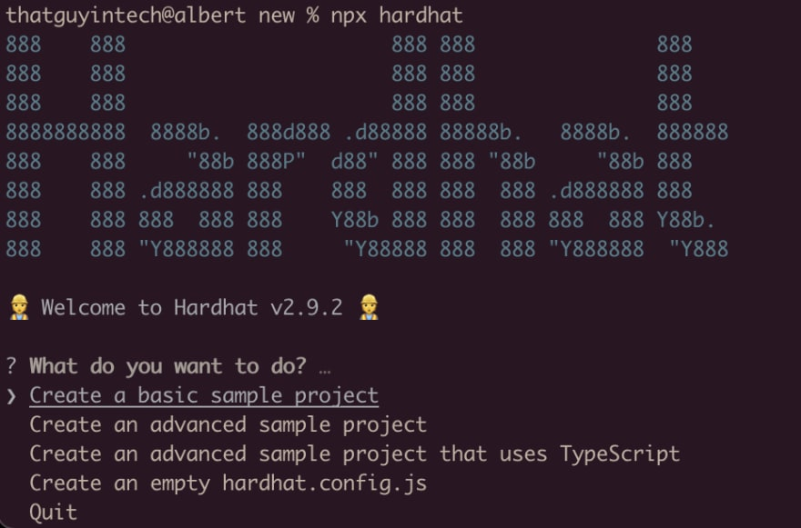

# How to Code and Deploy a Polygon Smart Contract


HELLO!

If you are new to blockchain development and don’t know where to start, or if you've explored Ethereum mainnet a bit and found it wayy tooo expensive.. this guide is for you :)

We will walk through coding, deploying, and interacting with a simple smart contract on the Polygon Mumbai test network using [Metamask](https://metamask.io), [Solidity](https://docs.soliditylang.org), [Hardhat](https://hardhat.org), [Ethers.js](https://docs.ethers.io/v5/), and [Alchemy](https://alchemy.com/?a=polygon-smart-contract).

And don’t worry if you don’t understand what any of this means yet, I'll explain everything!

If you have questions at any point in this tutorial, I recommend going through the following steps, **in order**:

1. Look for your question on [Ethereum StackExchange](https://dev.to/thatguyintech/how-to-deploy-a-polygon-smart-contract-tutorial-4k46-temp-slug-3983764?preview=2cedc557bb3a9a1bb329d6731ab2ac6397b61973ba6aa41af6d2df806ff5cc7f551177a7c0f1c42c799ef0b7d025a042f779846533cf9d3983721311) using the [Polygon](https://ethereum.stackexchange.com/questions/tagged/polygon) or [Alchemy](https://ethereum.stackexchange.com/questions/tagged/alchemy) tags.
2. Reach out for help in the [Alchemy Discord](https://www.alchemy.com/discord)!
3. Tweet at us [@AlchemyPlatform](https://twitter.com/AlchemyPlatform) or ask me directly [@thatguyintech](https://twitter.com/thatguyintech).

#### Our tools for this tutorial:

1. [Alchemy](https://alchemy.com/?a=polygon-smart-contract) provides a connection to the blockchain. It's like how Comcast provides the wires for you to connect to the rest of the internet, or how a copper or PVC pipe connects your kitchen sink to the rest of your neighborhood's plumbing. Alchemy also provides other tools and services such as [testnet ether faucets](https://mumbaifaucet.com) and [Enhanced APIs](https://docs.alchemy.com/alchemy/enhanced-apis/nft-api).
2. [Hardhat](https://hardhat.org) provides a developer environment so that we can easily configure environments, settings, and tests.
3. [Ethers.js](https://docs.ethers.io/v5/) is a Javascript SDK that provides a nice developer experience when you're writing code by wrapping lower-level JSON-RPC API calls.
4. [Solidity](https://docs.soliditylang.org) is the programming language we'll use for the smart contract portion of this project.
5. [Metamask](https://metamask.io) is a the crypto wallet we'll use to create and manage your Ethereum wallet address. You'll need this address to deploy to Polygon (or any other EVM-based blockchain).

Don't worry if that's a bit overwhelming at this point, you'll see how each of these tools works in action as we go through the tutorial!

Now buckle up and let's get started.

### Step 1. Initialize Your Project

First, we’ll need to create a folder for our project. Navigate to your command line and type:

```bash
mkdir polygon-smart-contract-tutorial
cd polygon-smart-contract-tutorial
```

Now that we’re inside our project folder, we’ll use `npm init --yes` to initialize the project. If you don’t already have `npm` installed, follow [these instructions](https://docs.alchemy.com/alchemy/guides/alchemy-for-macs#1-install-nodejs-and-npm) (we’ll also need Node.js so download that too!).

```bash
npm init --yes
```

You should see something like the following output based on your newly created project configuration `package.json`:

```json
Wrote to /Users/thatguyintech/Documents/co/polygon-smart-contract-tutorial/package.json:

{
  "name": "new",
  "version": "1.0.0",
  "description": "",
  "main": "index.js",
  "scripts": {
    "test": "echo \"Error: no test specified\" && exit 1"
  },
  "keywords": [],
  "author": "",
  "license": "ISC"
}
```

### Step 2. Download [Hardhat](https://hardhat.org/getting-started/#installation)

Hardhat is a development environment to compile, deploy, test, and debug your Ethereum software. It helps developers when building smart contracts and blockchain applications locally before deploying to a live chain.

Inside our `polygon-smart-contract-tutorial` project run:

```bash
npm install --save-dev hardhat
```

### Step 3. Create a Hardhat Project

Inside our `polygon-smart-contract-tutorial` project folder, run:

You should then see a welcome message and option to select what you want to do. Select `Create a basic sample project`:



And then just use all the default settings!\


```
✔ What do you want to do? · Create a basic sample project
✔ Hardhat project root: · /Users/thatguyintech/Documents/co/new
✔ Do you want to install this sample project's dependencies with npm (@nomiclabs/hardhat-waffle ethereum-waffle chai @nomiclabs/hardhat-ethers ethers)? (Y/n) · y
```

Hardhat will then generate a `hardhat.config.js` file for us along with a couple of folders with sample code we can work with, including `contracts`, `scripts`, and `test`.

### Step 4. Review Your Smart Contract

In `contracts/Greeter.sol`, we can see our example smart contract. Let's review it to understand a bit about what's going on in Solidity code!

Here's the entire contract code:

```solidity
//SPDX-License-Identifier: Unlicense
pragma solidity ^0.8.0;

import "hardhat/console.sol";

contract Greeter {
    string private greeting;

    constructor(string memory _greeting) {
        console.log("Deploying a Greeter with greeting:", _greeting);
        greeting = _greeting;
    }

    function greet() public view returns (string memory) {
        return greeting;
    }

    function setGreeting(string memory _greeting) public {
        console.log("Changing greeting from '%s' to '%s'", greeting, _greeting);
        greeting = _greeting;
    }
}
```

Let's break it down line by line :)

```solidity
//SPDX-License-Identifier: Unlicense
```

The [SPDX License Identifier](https://www.linuxfoundation.org/blog/solving-license-compliance-at-the-source-adding-spdx-license-ids/) lets other engineers know what they are allowed to do with your code. "[Unlicense](https://unlicense.org)" means that your code is free to use by public domain.

```solidity
pragma solidity ^0.8.0;
```

This line tells the solidity compiler which version it should use to compile your smart contract into byte code. `^0.8.0` means that any minor version from 0.8.0 and upwards is fair to use!

```solidity
contract Greeter {
  ...
}
```

Every smart contract is a collection of functions and data (its state). Once deployed, a contract resides at a specific address on the Ethereum blockchain. The `contract` syntax is very similar to working with classes or objects in other languages.

```solidity
string private greeting;
```

Here we define a state variable that the contract keeps track of, `greeting`. It is a string. Because it is marked with the `private` modifier, only the contract itself has permissions to modify it. Although the data is still visible and public on the blockchain, other contracts and accounts will not be able to access or modify a private variable.

This is useful in cases when you want to minimize access to your smart contract state. Otherwise you can use the `public` modifier.

```solidity
    constructor(string memory _greeting) {
        console.log("Deploying a Greeter with greeting:", _greeting);
        greeting = _greeting;
    }
```

Similar to many class-based object-oriented languages, a constructor is a special function that is only executed once, upon contract creation.

In our `Greeter` constructor, we expect a string `_greeting` to be passed in when the contract is deployed. We then log to hardhat console, and then write the `_greeting` string to the blockchain by setting it to the state variable `greeting`.

```solidity
    function greet() public view returns (string memory) {
        return greeting;
    }
```

Now we have our first smart contract function, `greet`.

This is a read-only function that does not cost any gas to execute because it doesn't change any blockchain state. It requires no input arguments either, and simply returns whatever the contract has saved in the private `greeting` variable.

```solidity
    function setGreeting(string memory _greeting) public {
        console.log("Changing greeting from '%s' to '%s'", greeting, _greeting);
        greeting = _greeting;
    }
```

`setGreeting` is a write function that will cost gas for users to execute because it modifies the `greeting` variable stored on the blockchain. Similar to the logic in the constructor, it takes in one string input and uses that to update the smart contract state variable.

\
Now that we understand some basics on how Solidity code works, let's finish setting up some accounts and configurations to prepare for deployment to the Polygon blockchain!

### Step 5. Connect to the Polygon blockchain network with Alchemy

There are many ways to make requests to the Polygon chain. For simplicity, we’ll use a free account on Alchemy, a blockchain developer platform and API that allows us to communicate with the Polygon chain without having to run our own nodes. The platform also has developer tools for monitoring and analytics that we’ll take advantage of in this tutorial to understand what’s going on under the hood during our smart contract deployment. If you don’t already have an Alchemy account, you can [sign up for free here](https://alchemy.com/?a=polygon-smart-contract).

Once you’ve created an Alchemy account, generate an API key by creating an app. This will allow us to make requests to the Mumbai test network. If you’re not familiar with testnets, check out [this guide](https://docs.alchemy.com/alchemy/guides/choosing-a-network#polygon).

Navigate to the “Create App” page in your Alchemy Dashboard by hovering over “Apps” in the nav bar and clicking “Create App”.


Name your app “Polygon Smart Contract”, offer a short description, select “Staging” for the Environment (used for your app bookkeeping), select “Polygon” for the chain, and "Polygon Mumbai" for the network.


Click “Create app” and that’s it! Your app should appear in your apps table.

By clicking on the "View Key" link to the right of the the table row for your app, you will be able to find the HTTP RPC URL you can use to access a Polygon Mumbai Testnet node using Alchemy.


You can see in our example that our HTTP URL is:

`https://polygon-mumbai.g.alchemy.com/v2/Ed7AeuPuIgo6fNDi49TDy_x4UBymLBsJ`

DO NOT SHARE THIS WITH ANYONE! This is your access to your node. If you share it, then others will be able to freely use up your app's resources and then you'll be sad.

Copy this down for later, we will use this in our MetaMask configuration, as well as in our hardhat configuration file to deploy the smart contract.

### Step 6. Create an Ethereum account!

Now we need an Ethereum account to send and receive transactions.

For this tutorial, we’ll use MetaMask, a virtual wallet in the browser used to manage your Ethereum account address.

You can download and create a MetaMask account for free [here](https://metamask.io).

### Step 7. Switch to the Polygon Mumbai test network

After you create your MetaMask account, make sure to switch over to the “Mumbai Test Network”.


MetaMask doesn't come with the Mumbai Test Network by default, so you will need to make some changes to create the connection. You can do this by clicking on your MetaMask profile icon and going down to settings.


Then click on "Networks" and then the "Add network" button.


Input the following settings:

* Network Name: Polygon Mumbai
* New RPC URL:
* Chain ID: 80001
* Currency Symbol: MATIC
* Block Explorer URL
* [https://mumbai.polygonscan.com](https://mumbai.polygonscan.com)


After you confirm the settings, MetaMask should automatically be connected to the new Polygon Mumbai test network.

### Step 8. Get some free test ETH from a faucet

Go to [https://mumbaifaucet.com/](https://mumbaifaucet.com) and input your wallet address (ethereum account address) from MetaMask.

You can get your wallet address by opening MetaMask and copying the long string that goes `0x...` at the top.


Once you input your wallet address into the faucet input box and click "Send Me MATIC", you will see a new transaction link show up. That links you to the polygonscan page where you can view a receipt of the faucet transaction. Here is an [example](https://mumbai.polygonscan.com/tx/0x9c20ebc97f9569ce66826d3e9956a750de867b38585ee24111519abd15167740).


Good stuff! Now that you have some "money", we can actually go back to our contract and deploy it!

### Step 9. Connect MetaMask and Alchemy to your project. <a href="#step9" id="step9"></a>

We’ve created a MetaMask wallet, Alchemy account, and written our smart contract, now it’s time to connect the three.

Every transaction sent from your virtual wallet requires a signature using your unique private key. To provide our program with this permission, we can safely store our private key (and Alchemy API key) in an environment file.

First, install the [dotenv](https://www.npmjs.com/package/dotenv) package in your project directory:

```bash
npm install dotenv --save
```

Then, create a `.env` file in the root directory of our project, and add your MetaMask private key and HTTP Alchemy API URL to it.


Your environment file must be named `.env` or it won't be recognized as an environment file. Do not name it `process.env` or `.env-custom` or anything else.


* Follow [these instructions](https://metamask.zendesk.com/hc/en-us/articles/360015289632-How-to-Export-an-Account-Private-Key) to export your private key
* Review the end of Step 5 to get your HTTP Alchemy API URL

So at this point, your `.env` file should look like this:

```
API_URL=https://polygon-mumbai.g.alchemy.com/v2/<your-api-key>
PRIVATE_KEY="your-metamask-private-key"
```

Now let's make sure these environment variables are correctly loaded in our hardhat project.

We'll use the `dotenv` module inside our `hardhat.config.js` file to do so.

### Step 13: Update hardhat.config.js

We’ve added several dependencies and plugins so far, now we need to update hardhat.config.js so that our project knows about all of them.

Update your `hardhat.config.js` to look like this:

```javascript
require("@nomiclabs/hardhat-waffle");
require("dotenv").config();

const { API_URL, PRIVATE_KEY } = process.env;

// This is a sample Hardhat task. To learn how to create your own go to
// https://hardhat.org/guides/create-task.html
task("accounts", "Prints the list of accounts", async (taskArgs, hre) => {
  const accounts = await hre.ethers.getSigners();

  for (const account of accounts) {
    console.log(account.address);
  }
});

// You need to export an object to set up your config
// Go to https://hardhat.org/config/ to learn more

/**
 * @type import('hardhat/config').HardhatUserConfig
 */
module.exports = {
  solidity: "0.8.4",
  networks: {
    mumbai: {
      url: API_URL,
      accounts: [`0x${PRIVATE_KEY}`]
    }
  }
};
```

Note that with `dotenv`, we can access variables defined in our `.env` file by using `process.env`.

Inside the [hardhat config](https://hardhat.org/config/), we define a new network called `mumbai` that uses the Alchemy HTTP URL and our MetaMask account to talk to the blockchain.

### Step 14: Compile our contract

To make sure everything is working so far, let’s compile our contract. The `compile` task is one of the built-in hardhat tasks.

From the command line run:

```bash
npx hardhat compile
```

If all goes well, you should see something like this output in your terminal:

```
thatguyintech@albert new % npx hardhat compile
Compiled 1 Solidity file successfully
```

At this point, if you have any issues, please check previous discussions on [Ethereum Stackexchange](https://ethereum.stackexchange.com) using the [Alchemy](https://ethereum.stackexchange.com/questions/tagged/alchemy), [Polygon](https://ethereum.stackexchange.com/questions/tagged/polygon), or [Hardhat](https://ethereum.stackexchange.com/questions/tagged/hardhat) tags, or create your own question!

### Step 15: Deploy our contract

We’re finally ready to deploy our smart contract! Navigate to the command line and run:

```bash
npx hardhat run scripts/sample-script.js --network mumbai
```

You should then see output similar to this (with different address string):

```
Greeter deployed to: 0x8Fab93D28e52a93d4b00E25Eaa04B64223382f89
```

You can now paste this contract address into [https://mumbai.polygonscan.com/](https://mumbai.polygonscan.com) and find details about your deployed contract.

For example, you can see when the contract was deployed, how much the transaction fee cost, and which wallet address was responsible for the deployment.


Copy your contract address (i.e. `0x8Fab93D28e52a93d4b00E25Eaa04B64223382f89`) and create a new line in your `.env` file to keep track of it for the next step.

Your `.env` file should look like this:

```
```

Congrats! You just deployed a smart contract to the Polygon sidechain 🎉

To understand what’s going on under the hood, let’s navigate to the Explorer tab in our [Alchemy dashboard](https://dashboard.alchemyapi.io/explorer). If you have multiple Alchemy apps, make sure to filter by app and select "Polygon Smart Contract".


Here you’ll see a handful of JSON-RPC calls that Hardhat/Ethers made under the hood for us when we called the `.deploy()` function. Two important ones to call out here are [eth\_sendRawTransaction](https://docs.alchemy.com/alchemy/apis/ethereum/eth\_sendrawtransaction), which is the request to actually write our contract onto the Polygon chain, and [eth\_getTransactionByHash](https://docs.alchemy.com/alchemy/apis/ethereum/eth\_gettransactionbyhash) which is a request to read information about our transaction given the hash (a typical pattern when sending transactions).

### Step 16: Create greet.js to interact with the contract

Now that we have a contract deployed to the blockchain, we interact with it by writing a script!&#x20;

In your `scripts` folder, creates a file called `scripts/greet.js`. Read through the comments to understand what's going on!

```javascript
// scripts/greet.js

const hre = require("hardhat");
const ContractJson = require("../artifacts/contracts/Greeter.sol/Greeter.json");
// The ABI is very important -- it's the interface to your contract, including
// the different available functions that are exposed for other contracts,
// accounts, etc. to call.
const abi = ContractJson.abi;

async function main() {
    // Notice that we're using process.env.ALCHEMY_API_KEY to load an
    // environment variable. If you are seeing errors, make sure to go
    // back to Step 12 and 13 to set up the dotenv dependency and .env
    // file correctly!
    const alchemy = new hre.ethers.providers.AlchemyProvider(
        'maticmum',
        process.env.ALCHEMY_API_KEY
    );
    // We're using the same wallet private key for the wallet that you
    // created in Step 6. 
    const userWallet = new hre.ethers.Wallet(process.env.PRIVATE_KEY, alchemy);

    // Get the deployed contract. We need both the specific CONTRACT_ADDRESS
    const Greeter = new hre.ethers.Contract(
        process.env.CONTRACT_ADDRESS,
        abi,
        userWallet
    )

    // We're going to issue two write-transactions to modify the state
    // of the Polygon blockchain via our Greeter smart contract.
    
    // The first transaction sets a new greeting with setGreeting, and then
    // waits for the transaction to be mined before doing a sanity
    // check and checking the new greeting state.
    const setTx1 = await Greeter.setGreeting("web3 sucks!");
    await setTx1.wait();
    console.log("before: " + await Greeter.greet());

    // The second transaction does the exact same thing with a new input.
    const setTx2 = await Greeter.setGreeting("web3 is awesome!");
    await setTx2.wait();
    console.log("after: " + await Greeter.greet());
}

main()
    .then(() => process.exit(0))
    .catch((error) => {
        console.error(error);
        process.exit(1);
    });

```


Notice that we're using `process.env.ALCHEMY_API_KEY`, etc., to load environment variables. If you're getting errors related to this, there may be something off with your `dotenv` dependency or `hardhat.config.js` configurations. Retry Steps 12 and 13 to set up the `dotenv` dependency again!

Also check [Ethereum StackExchange](https://ethereum.stackexchange.com/questions/111731/error-hh8-theres-one-or-more-errors-in-your-config-file-expected-a-value-of-t) to see if anyone else has seen the same issues!


Before you run the script, we also need to define some new environment variables. Remember your  `.env` file from [Step 9](https://docs.alchemy.com/alchemy/tutorials/how-to-deploy-a-polygon-smart-contract#step-9)? We're going to add a few variable definitions, like this:

```
API_URL=https://polygon-mumbai.g.alchemy.com/v2/<your-api-key>
PRIVATE_KEY="your-wallet-private-key"
CONTRACT_ADDRESS="your-contract-address-deployed-to-polygon-mumbai"
ALCHEMY_API_KEY="<your-api-key>"
```

Make sure you **save** after editing your `.env` file so that the changes are persisted!

And now we're ready to run the script:

`npx hardhat run scripts/greet.js`

After running that command on your command line, you should see output like this:

```
thatguyintech@albert polygon-smart-contract-tutorial % npx hardhat run scripts/greet.js
before: web3 sucks!
after: web3 is awesome!
```

You can also verify that Alchemy has broadcasted and mined your transaction by going to the [Alchemy Mempool Watcher](https://dashboard.alchemyapi.io/mempool) and taking a look at your most recent transaction. By clicking into that transaction, you should see something like this that provides all the information you might want to know about your transaction, including what `Block Number` it was mined in, which `From Address` initiated the transaction, which `To Address` is the recipient of the transaction, how much `Value` (in MATIC) exchanged hands, what the transaction fees were, and much more:


And that's all for now! You've learned a little bit about Solidity, set up some key accounts and tooling for building smart contracts,  deployed your first smart contract to Polygon, and wrote a script to interact with the contract! You're well on your way to becoming a blockchain developer :)

If you enjoyed this tutorial, give us a tweet [@AlchemyPlatform](https://twitter.com/AlchemyPlatform)!&#x20;

(Or you can also just tell the original author of this tutorial [@thatguyintech](https://twitter.com/thatguyintech) how awesome he is :joy:)

And join our [Discord server](https://www.alchemy.com/discord) to meet other blockchain devs, builders, and entrepreneurs!&#x20;
